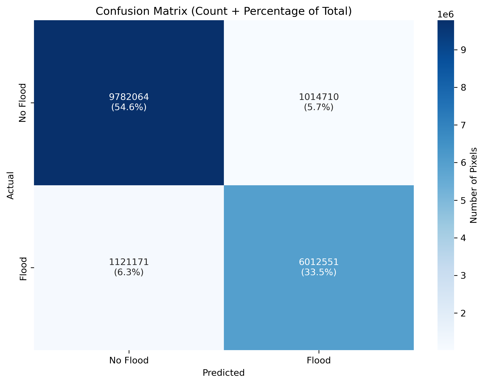
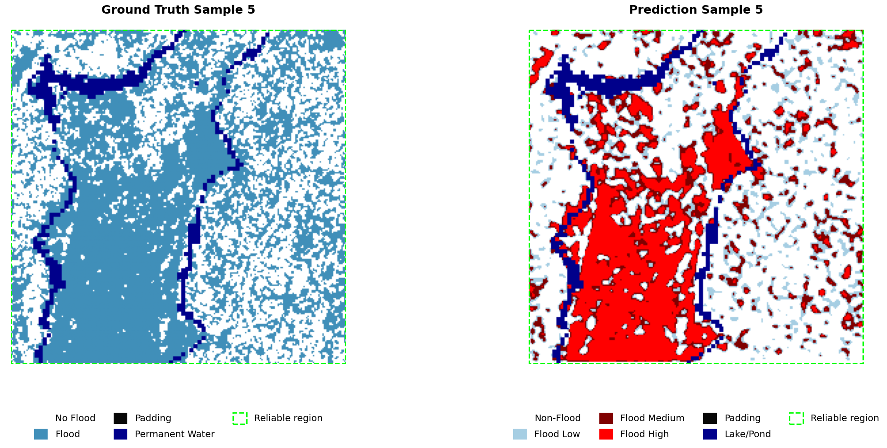
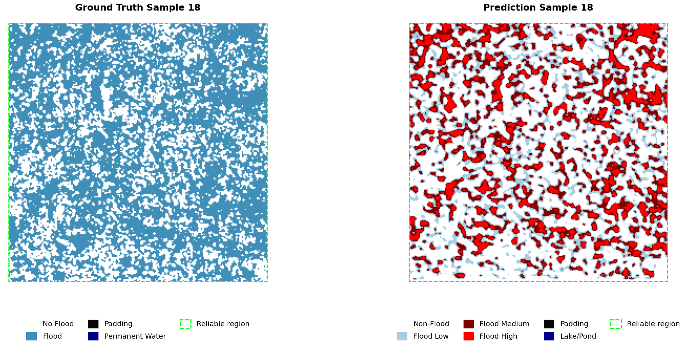

# Bangalore Urban Flood Extent Prediction

This project aims to predict flood depth using satellite imagery and a CNN. It is structured for enterprise-level scalability, maintainability, and includes a professional logging system.

## Results

### Evaluation Metrics
Loss:          0.344655 <br>
Accuracy:      0.8809 <br>
Precision:     0.8556 <br>
Recall:        0.8428 <br>
F1 Score:      0.8492 <br>
IoU:           0.7379 <br>
Dice Coefficient: 0.8492 <br> <br>

### Confusion matrix


## Ground Truth Vs Prediction comparision
 <br>



## Setup

1.  **Create Project:** Run `python setup_project.py` to generate the structure.
2.  **Navigate:** `cd Bangalore-Urban-Flood-Extent-Prediction`
3.  **Set up Environment:**
    ```bash
    python -m venv venv
    source venv/bin/activate
    pip install -r requirements.txt
    ```
4.  **Run Pipeline:** using main.ipynb
5. **Test Flask API:** using test_api_from_client_side.ipynb

## Logging

This project uses a centralized logging system.
- Logs are saved to the `/logs` directory.
- Different pipeline stages have their own log files (e.g., `data_pipeline.log`, `model_pipeline.log`).
- Logs are also printed to the console for real-time monitoring.